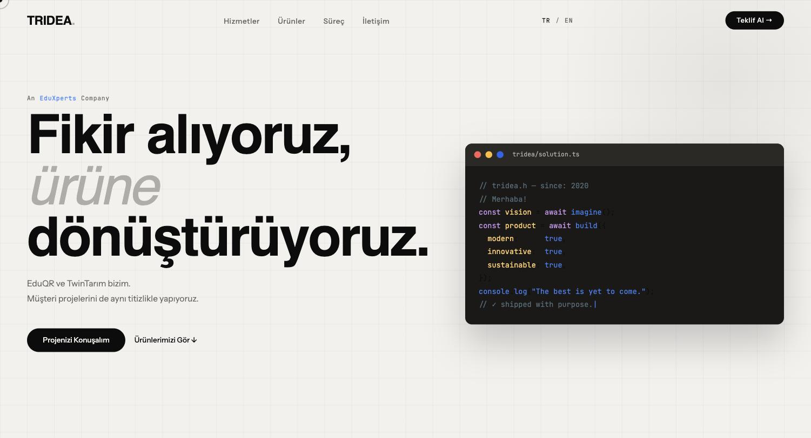
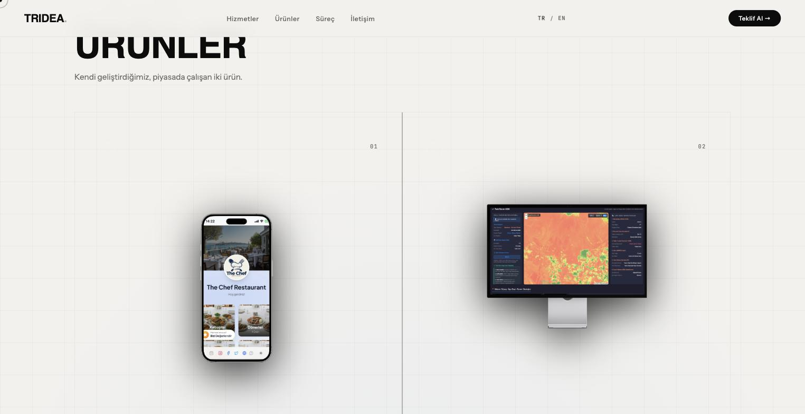
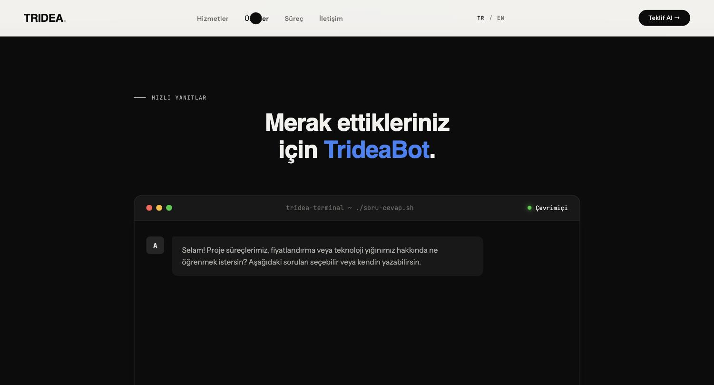
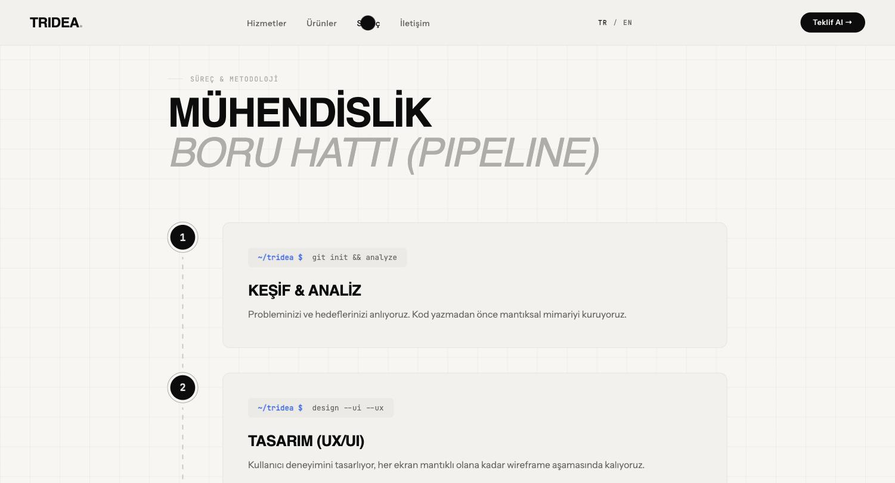
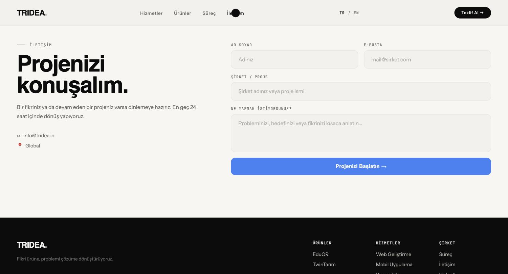

# Tridea — Software Studio Landing Page

Landing page for Tridea, a software studio operating under [EduXperts Eğitim Danışmanlık ve Yazılım A.Ş.](https://eduxperts.com.tr) that builds web, mobile, and AI software.

**Live products:**
- [EduQR](https://eduqr.tr) — QR-based digital menu system (SaaS)
- [TwinTarım](https://www.twintarim.space) — satellite-data-driven agricultural decision support platform

## About

A single-page, fully **static** site. No framework, build tooling, or backend dependency — the files can be opened directly in a browser or served from any static file host.

### Sections
- **Hero** — typewriter-animated code window
- **Services** (`#hizmetler`) — sticky-scroll card list (web, mobile, AI/backend, enterprise SaaS)
- **Products** (`#urunler`) — EduQR and TwinTarım portfolio grid
- **TrideaBot** (`#sorular`) — demo chatbot UI with predefined answers
- **Process** (`#nasil`) — pipeline visualization
- **Why Us** (`#neden`) — dark bento grid cards
- **Contact** (`#iletisim`) — contact form

### Features
- TR/EN language toggle (via `data-i18n` attributes)
- Scroll-triggered reveal animations (`IntersectionObserver`)
- Custom cursor, marquee strip, responsive mobile menu
- No external libraries/CDNs besides Google Fonts

## Demo


## Screenshots

| Hero | Products |
|---|---|
|  |  |

| TrideaBot | Engineering Pipeline |
|---|---|
|  |  |



## Tech Stack

| Layer | Used |
|---|---|
| HTML | Single file, plain HTML5 |
| CSS | `css/style.css` — custom-property-based hand-written CSS, no framework |
| JS | `js/main.js` — plain vanilla JavaScript, no library/framework |
| Fonts | Google Fonts: Cabinet Grotesk, Instrument Sans, JetBrains Mono |

## Project Structure

```
tridea/
├── index.html          All page content and sections
├── css/
│   └── style.css        All styles (design system, animations, responsive)
├── js/
│   └── main.js           i18n, animations, sticky-scroll, TrideaBot, form
└── assets/
    ├── images/            Product images (EduQR, TwinTarım mockups/backgrounds)
    └── screenshots/        README preview screenshots
```

## Running Locally

No build step required. Any static server works:

```bash
# Simple option
python3 -m http.server 8000
# or
npx serve .
```

Then open `http://localhost:8000` in your browser.

## Known Limitations / TODO

- **The contact form and TrideaBot are not connected to a real backend.** Form submission only simulates UI feedback (no data is actually sent anywhere); TrideaBot returns static, predefined answers — there is no real AI/LLM integration.
- The PNGs under `assets/images/` are large (~15 MB total, `twintarim-bg.png` alone is ~5.6 MB) — should be compressed/optimized.
- `css/style.css` has some duplicated/conflicting rule blocks (selectors like `.product-card`, `.mockup-img`, `.phone-mockup` are defined more than once) and one malformed/orphaned rule — needs cleanup.
- The brand was renamed from "Atay" to "Tridea" mid-project; some leftover traces of the old name remain (e.g. the `A` avatar letter in the chat UI).
- The `*_eski.png` (old) images can be removed if no longer used.
- No `.gitignore`; `.DS_Store` files have leaked into the repo — worth adding one.

## Developer

Tridea is a site built to showcase projects developed together by three university friends. The website itself (HTML/CSS/JS) was built entirely by Esranil Doğan.

## License

Not specified.
